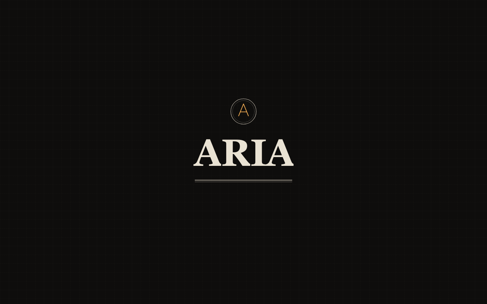
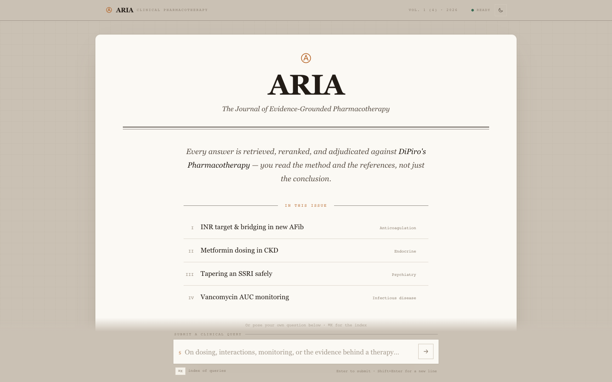
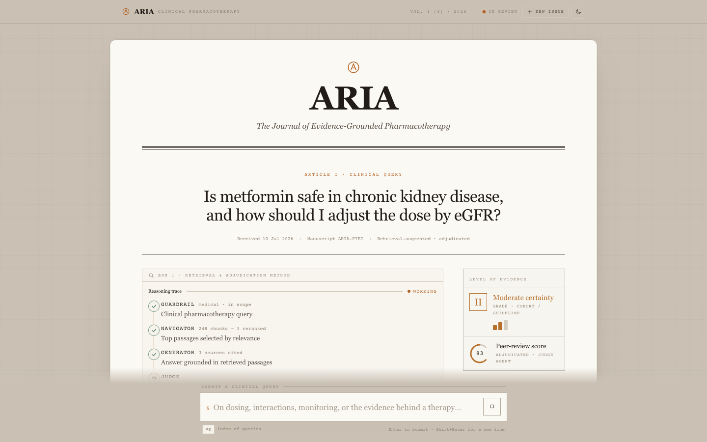

<div align="center">

# ARIA

**The Journal of Evidence-Grounded Pharmacotherapy**

A multi-agent, retrieval-augmented clinical assistant that answers pharmacotherapy
questions strictly from the textbook evidence — with page-level citations, a graded
evidence tier, and an independently judged confidence score on every answer.

[**▶ Live demo**](https://mohitrks-aria.hf.space) · [How it works](#how-it-works) · [Retrieval stack](#retrieval-stack) · [Getting started](#getting-started)


<br/>



</div>

---

## What it does

ARIA answers clinical pharmacotherapy questions the way a journal publishes evidence.
Its knowledge comes from two reference texts — **DiPiro's Pharmacotherapy: A
Pathophysiologic Approach (12e)** and the **RxPrep NAPLEX Course Book (2025)** —
and every answer is:

- **Generated only from retrieved passages**, never from the model's open-ended memory
- **Cited at page level**, with the source book, page, and snippet behind every claim
- **Independently adjudicated** by a Judge agent that scores groundedness and
  relevance before the answer is allowed to reach the user
- **Graded for evidence certainty** and delivered with a visible confidence gauge

<div align="center">

</div>

## How it works

A LangGraph state machine routes every query through four specialised agents:

```
                 ┌────────────┐
   query ──────► │ Guardrail  │── out of scope ──► polite refusal
                 └─────┬──────┘
                       │ in scope
                 ┌─────▼──────┐
                 │ Navigator  │  rewrites the query, retrieves from Qdrant,
                 └─────┬──────┘  reranks with a cross-encoder
                       │ top passages
                 ┌─────▼──────┐
                 │ Generator  │  synthesises an answer from the passages only
                 └─────┬──────┘
                       │ draft answer
                 ┌─────▼──────┐
                 │   Judge    │  scores groundedness + relevance (0–1)
                 └─────┬──────┘
                       │
        confidence ≥ 0.7 ──► final answer (with citations & confidence)
        confidence < 0.7 ──► regenerate (up to 3 attempts)
```

| Agent | Role |
|---|---|
| **Guardrail** | Classifies whether the query is within clinical scope; everything else is refused before any retrieval happens. |
| **Navigator** | Rewrites the question into an optimised medical search query, performs **source-balanced retrieval** (a global candidate set plus a guaranteed RxPrep set via metadata filter, so the smaller book is never drowned out), then keeps only the most relevant passages via cross-encoder reranking. |
| **Generator** | Synthesises the answer from the retrieved passages only (Llama 3.3 70B via Groq), keeping every response traceable to the source texts. |
| **Judge** | Independently scores the draft for groundedness and relevance. Low-confidence answers are regenerated; the score surfaces in the UI as a confidence gauge and evidence tier. |

## Retrieval stack

| Layer | Choice |
|---|---|
| Embeddings | `all-MiniLM-L6-v2` (384-dim, normalised) |
| Vector store | Qdrant Cloud — collection `aria_medical`, cosine distance |
| Corpus | 31,000+ chunks across both books, with source/book/page metadata |
| First-stage search | Dense similarity + MMR, source-balanced across books |
| Second-stage rerank | Cohere `rerank-english-v3.0` cross-encoder |

Embeddings are computed once during ingestion and served from Qdrant Cloud, which
keeps the deployed footprint small — the app itself only embeds the incoming query
at request time.

## The web experience

The frontend (React + TypeScript + Vite + Tailwind + Framer Motion) is designed as a
**clinical research journal**. The app opens on an animated cover page — the ARIA
colophon draws itself in ink and the cover lifts away into the consultation. Each
answer is then typeset as a peer-reviewed article: prose on the left, a live
**evidence margin** on the right, citations that dock into the margin as the answer
streams, and the four-agent pipeline rendered as a live reasoning trace over
Server-Sent Events.

<div align="center">

</div>

See [`web/README.md`](web/README.md) for the full design notes.

## Project structure

```
aria/
├── agents/              # Guardrail, Navigator and Judge agents
├── api/                 # FastAPI bridge server (SSE streaming)
├── graph/               # LangGraph pipeline: state, nodes, routing
├── ingestion/           # PDF loading, OCR, cleaning, chunking, embedding
├── llm/                 # LLM setup (Groq), prompts, answer generator
├── retrieval/           # Retriever + source-balanced Cohere reranking
├── vectorstore/         # Qdrant Cloud store loader
├── web/                 # React frontend (journal UI)
├── Dockerfile           # Two-stage build for Hugging Face Spaces
├── migrate_to_qdrant.py # One-time migration: local store → Qdrant Cloud
└── requirements.txt
```

## Getting started

**Prerequisites:** Python 3.11+, Node 18+, and API keys for
[Groq](https://console.groq.com), [Cohere](https://dashboard.cohere.com) and
[Qdrant Cloud](https://cloud.qdrant.io).

```bash
# 1. Backend setup
python3 -m venv aria_env
source aria_env/bin/activate
pip install -r requirements.txt

# 2. Configure secrets
cp .env.example .env       # then fill in your keys

# 3. Run the API server
uvicorn api.server:app --port 8000

# 4. Run the frontend (separate terminal)
cd web
npm install
npm run dev                # http://localhost:5183
```

You can also exercise the pipeline directly from the command line:

```bash
python graph/aria_graph.py       # runs the full agent graph on test queries
python retrieval/retriever.py    # retrieval smoke test
```

**Deployment.** The included `Dockerfile` builds the frontend and serves API + UI
from a single container on port 7860 — the exact image running on
[Hugging Face Spaces](https://mohitrks-aria.hf.space). Runtime dependencies live in
`requirements-space.txt`; the full `requirements.txt` additionally covers local
ingestion tooling.

> **Note on source texts:** the reference PDFs are copyrighted and are not included
> in this repository. The ingestion pipeline (`ingestion/`) documents how the corpus
> was built: PDF parsing (with OCR for scanned pages) → cleaning → chunking →
> embedding → upload to Qdrant.

## Safety posture

ARIA is an educational project. Answers are generated from textbook evidence and
each response carries an explicit caution to verify against current guidelines and
patient context. It is not a substitute for professional medical judgement.

## Authors

- **Mohit** — [@Mohitoo6](https://github.com/Mohitoo6)
- **Rohit** — [@Rohit-0612](https://github.com/Rohit-0612)
