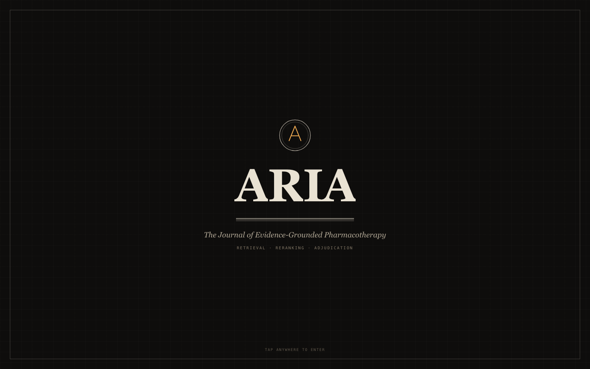
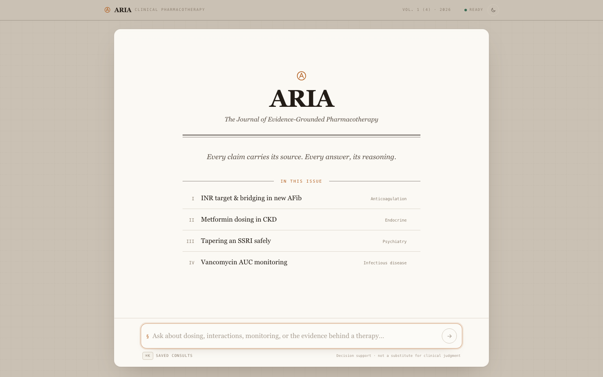
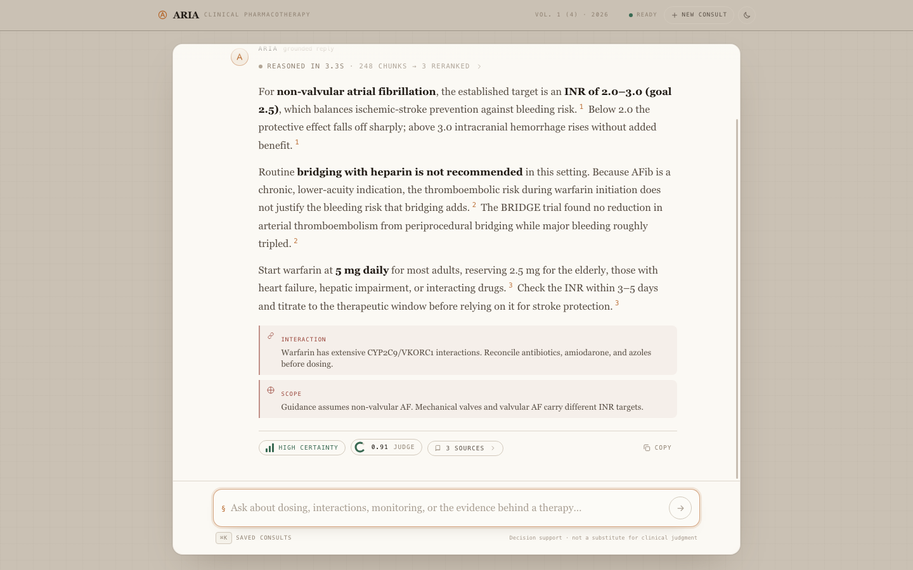
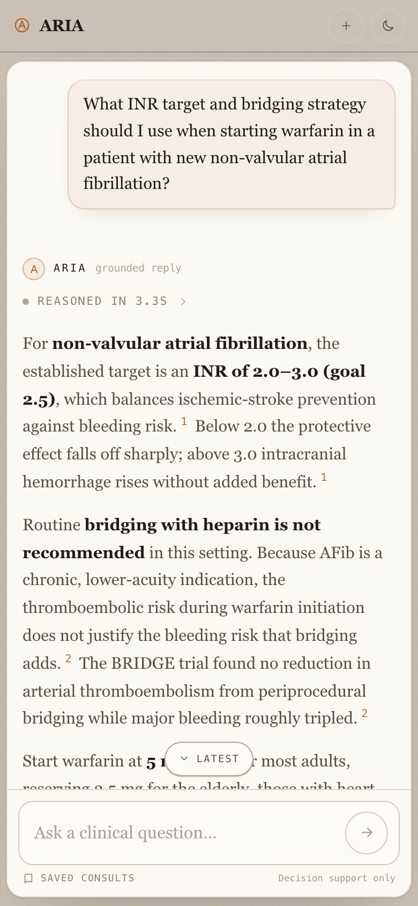

<div align="center">

# ARIA

**The Journal of Evidence-Grounded Pharmacotherapy**

A multi-agent, retrieval-augmented clinical assistant that answers pharmacotherapy
questions strictly from the textbook evidence — with page-level citations, a graded
evidence tier, and an independently judged confidence score on every answer.

[How it works](#how-it-works) · [Retrieval stack](#retrieval-stack) · [Getting started](#getting-started)


<br/>



</div>

---

## What it does

ARIA answers clinical pharmacotherapy questions the way a journal publishes evidence.
Its knowledge comes from two reference texts — **DiPiro's Pharmacotherapy: A
Pathophysiologic Approach (12e)** and the **RxPrep NAPLEX Course Book (2025)** —
and every answer is:

- **Generated only from retrieved passages**, never from the model's open-ended memory
- **Cited at page level**, with the source book, page, and snippet behind every claim
- **Independently adjudicated** by a Judge agent that scores groundedness and
  relevance before the answer is allowed to reach the user
- **Graded for evidence certainty** and delivered with a visible confidence gauge

<div align="center">

</div>

## How it works

A LangGraph state machine routes every query through four specialised agents:

```
                 ┌────────────┐
   query ──────► │ Guardrail  │── out of scope ──► polite refusal
                 └─────┬──────┘
                       │ in scope
                 ┌─────▼──────┐
                 │ Navigator  │  rewrites the query, retrieves from Qdrant,
                 └─────┬──────┘  reranks with a cross-encoder
                       │ top passages
                 ┌─────▼──────┐
                 │ Generator  │  synthesises an answer from the passages only
                 └─────┬──────┘
                       │ draft answer
                 ┌─────▼──────┐
                 │   Judge    │  scores groundedness + relevance (0–1)
                 └─────┬──────┘
                       │
                  final answer (with citations & confidence)
```

This graph is the pipeline — there is not a second copy of it. The API server
drives the compiled graph and translates its events into SSE; it holds no
agent order, routing or failure policy of its own. Each node also narrates
its own progress, so the agent trace the reader watches is emitted by the
code that actually ran.

| Agent | Role |
|---|---|
| **Guardrail** | Classifies whether the query is within clinical scope; everything else is refused before any retrieval happens. |
| **Navigator** | Rewrites the question into an optimised medical search query, performs **source-balanced retrieval** (a global candidate set plus a guaranteed RxPrep set via metadata filter, so the smaller book is never drowned out), then keeps only the most relevant passages via cross-encoder reranking. |
| **Generator** | Synthesises the answer from the retrieved passages only (`openai/gpt-oss-120b` via Groq), keeping every response traceable to the source texts. |
| **Judge** | Independently scores the finished answer for groundedness and relevance. The score surfaces in the UI as a confidence gauge and evidence tier. When the Judge cannot score an answer, the UI shows **Not adjudicated** rather than a placeholder number. |

The answer is **streamed as the model writes it**, so the first words appear
while the rest is still being generated. The Judge scores the finished text,
so the confidence gauge and the source rail arrive with the completed turn
rather than before it.

Each agent's model is configured by role in `llm/config.py` — the generator
gets the larger model, while the guardrail, query rewrite and judge run on
`openai/gpt-oss-20b`. Nothing is hardcoded: every ID is overridable via an
`ARIA_*_MODEL` environment variable, validated against the provider's live
model list at startup, and backed by an automatic fallback if a model is
decommissioned mid-flight.

## Retrieval stack

| Layer | Choice |
|---|---|
| Embeddings | `all-MiniLM-L6-v2` (384-dim, normalised) |
| Vector store | Qdrant Cloud — collection `aria_medical`, cosine distance |
| Corpus | 31,000+ chunks across both books, with source/book/page metadata |
| First-stage search | Dense similarity, source-balanced across books |
| Second-stage rerank | Cohere `rerank-english-v3.0` cross-encoder |
| Evidence floor | Passages the reranker scores below `ARIA_RELEVANCE_FLOOR` (0.02) are not cited |

Retrieval returns the passages that are actually relevant rather than a fixed
count: the reranker emits its top *n* whether or not that many are any good,
so a thin query used to pad the citation list with material it had scored 0.0
— including book index pages and printer footers — each shown with a page
number and a relevance bar. If nothing clears the floor, the consultation
fails rather than answering from passages the reranker just rejected.

Embeddings are computed once during ingestion and served from Qdrant Cloud, which
keeps the deployed footprint small — the app itself only embeds the incoming query
at request time.

## The web experience

The frontend (React + TypeScript + Vite + Tailwind + Framer Motion) is an editorial
take on a chat interface — the typography of a **clinical research journal** in the
rhythm of a conversation. The app opens on an animated cover page: the ARIA colophon
draws itself in ink and the cover lifts away into the consultation. From there the
transcript scrolls inside one framed sheet with the composer docked at its foot.
Above each reply, the four-agent pipeline runs as a live thinking strip that folds
into a single receipt line when it's done; below it, GRADE certainty, the Judge's
confidence and the grounded sources sit in one quiet instrument row. Citation
markers open the exact retrieved passage they rest on.

<div align="center">

</div>

The same build serves a phone — the layout adapts rather than shipping a second
frontend.

<div align="center">

</div>

See [`web/README.md`](web/README.md) for the full design notes.

## Project structure

```
aria/
├── agents/              # Guardrail, Navigator and Judge agents
├── api/                 # FastAPI bridge server (SSE streaming)
├── evals/               # Evaluation suite (guardrail, retrieval, answer quality)
├── graph/               # LangGraph pipeline: state, nodes, routing
├── ingestion/           # PDF loading, OCR, cleaning, chunking, embedding
├── llm/                 # Model config, preflight, prompts, answer generator
├── retrieval/           # Retriever + source-balanced Cohere reranking
├── vectorstore/         # Qdrant Cloud store loader
├── web/                 # React frontend (journal UI)
├── docs/                # Screenshots and operational runbooks
├── Dockerfile           # Two-stage build for Hugging Face Spaces
├── migrate_to_qdrant.py # Restore/migrate embeddings into Qdrant (no re-embedding)
└── requirements.txt
```

## Getting started

**Prerequisites:** Python 3.11+, Node 18+, and API keys for
[Groq](https://console.groq.com), [Cohere](https://dashboard.cohere.com) and
[Qdrant Cloud](https://cloud.qdrant.io).

```bash
# 1. Backend setup
python3 -m venv aria_env
source aria_env/bin/activate
pip install -r requirements.txt

# 2. Configure secrets
cp .env.example .env       # then fill in your keys

# 3. Run the API server
uvicorn api.server:app --port 8000

# 4. Run the frontend (separate terminal)
cd web
npm install
npm run dev                # http://localhost:5183
```

You can also exercise the pipeline directly from the command line:

```bash
python -m graph.aria_graph       # runs the full agent graph on test queries
python -m retrieval.reranker     # retrieval smoke test
python -m vectorstore.qdrant_store  # evidence-base health probe
python -m llm.preflight          # model availability probe
```

## Health and operations

`GET /api/health` is a real dependency check, not a liveness ping. It reports
both hard dependencies and returns **503** unless a consultation would
actually succeed:

```json
{
  "status": "ok",
  "models":       { "ok": true, "checked": ["openai/gpt-oss-20b", "openai/gpt-oss-120b"] },
  "evidenceBase": { "ok": true, "collection": "aria_medical", "points": 31228, "vectorSize": 384 }
}
```

A present-but-empty collection is reported as an outage: with no passages
there is nothing to ground an answer in. Point an uptime monitor here.

`/api/consult` is rate limited, because it is public and every call spends
real quota — four model calls plus a rerank — against Groq's 8000 TPM
ceiling. Per-client requests are capped by `ARIA_RATE_LIMIT` (10 per minute)
and total concurrency by `ARIA_MAX_CONCURRENT` (4); a throttled request
returns on the error channel, so the UI shows a fault rather than an empty
reply.

If the vector store is unreachable — Qdrant Cloud removes inactive free-tier
clusters — see **[docs/runbook-evidence-base.md](docs/runbook-evidence-base.md)**
for the restore procedure.

## Evaluation

A lightweight eval suite exercises the real pipeline over a labelled query set and
scores guardrail accuracy, retrieval source balance, and answer groundedness /
relevance via an independent LLM judge:

```bash
python evals/run_evals.py        # prints a summary, saves evals/results.json
```

Latest run (July 2026, full pipeline against Qdrant Cloud + Groq + Cohere):

| Metric | Score |
|---|---|
| Guardrail accuracy (6 in-scope + 4 out-of-scope) | **10/10 (100%)** |
| Groundedness (independent LLM judge, mean) | **0.92** |
| Relevance (mean) | **1.00** |
| Pass rate (groundedness & relevance ≥ 0.7) | **6/6** |
| Both books cited in the evidence set | 4/6 queries |

**Deployment.** The included `Dockerfile` builds the frontend and serves API + UI
from a single container on port 7860, ready to deploy as a Docker
[Hugging Face Space](https://huggingface.co/docs/hub/spaces-sdks-docker). Runtime dependencies live in
`requirements-space.txt`; the full `requirements.txt` additionally covers local
ingestion tooling.

> **Note on source texts:** the reference PDFs are copyrighted and are not included
> in this repository. The ingestion pipeline (`ingestion/`) documents how the corpus
> was built: PDF parsing (with OCR for scanned pages) → cleaning → chunking →
> embedding → upload to Qdrant.

## Safety posture

ARIA is an educational project. Answers are generated from textbook evidence and
each response carries an explicit caution to verify against current guidelines and
patient context. It is not a substitute for professional medical judgement.

The design rule underneath that: **nothing that is not an adjudicated, grounded
answer may ever be rendered as one.** In practice this means ARIA fails closed
rather than degrading quietly.

- A provider or retrieval failure travels on its own SSE channel to its own UI
  state — never as answer prose, and never carrying an evidence tier,
  confidence score or citations.
- **Retrieval failures name the evidence base, not the language model**, so an
  outage is diagnosed against the dependency that actually broke.
- **No passages means no answer.** An empty retrieval raises rather than
  handing the generator an empty context, which would produce an answer from
  the model's own memory wearing ARIA's citation furniture.
- An unreachable guardrail stops the turn instead of defaulting to "in scope".
- An unavailable Judge leaves `confidence: null` — never a placeholder number
  drawn on a calibrated gauge.
- The in-browser sample responses used for UI development are **dev-only by
  construction** (`VITE_ARIA_MOCK=1`) and cannot be reached from a production
  build. They were previously an automatic fallback when the backend was slow
  to respond, which could present invented clinical content as a real answer.

## Author

- **Rohit** — [@Rohit-0612](https://github.com/Rohit-0612)
